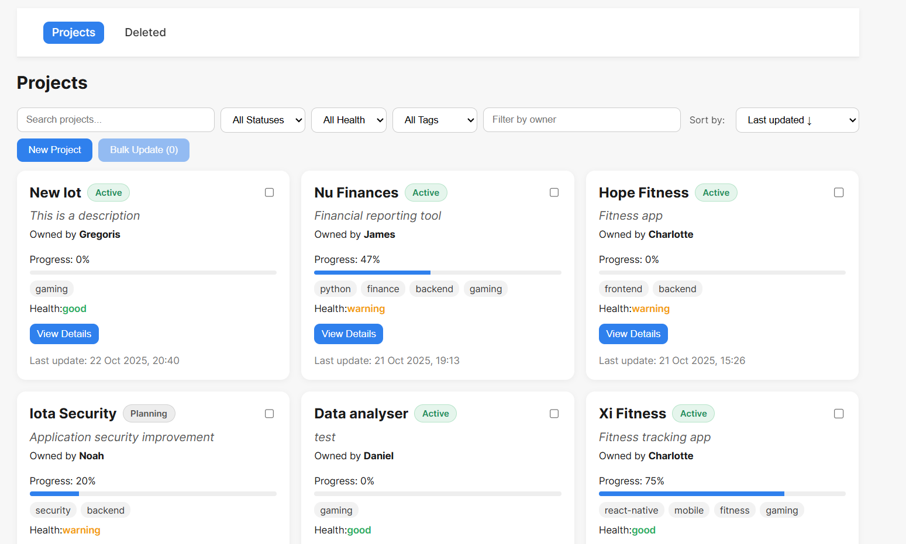

# 🧭 Project Management Dashboard

A full-stack **Project Management Dashboard** built with **React (Vite)** and **Django REST Framework**, designed to manage, visualize, and update projects.  
The system is fully containerized, automated with CI/CD (GitHub Actions), and served via **Nginx**.

Repository: [tsoumarios/Project-management-dashboard](https://github.com/tsoumarios/Project-management-dashboard)


---

## 🚀 Features Overview

### 🖥️ Frontend

- **Single Page Application (SPA)** built with React + TypeScript + Vite
- **Project Cards View**:
  - Paginated (9 per page)
  - Sortable and filterable (status, owner, tag, health)
  - Soft delete and recover options
- **Project Detail View**: Description, progress, tags, health
- **Bulk Update**: change status or tag for multiple projects atomically
- **Real-Time Updates**: implemented via Server-Sent Events (SSE)
- **Search**: free-text search across titles, descriptions, and tags
- **Optimistic Concurrency**: handled via ETag / version validation

---

### ⚙️ Backend

- **Django REST Framework** for CRUD, pagination, and filters
- **Soft Delete** model pattern (`is_deleted` flag) with recover endpoints
- **Transactional Bulk Updates** using `@transaction.atomic()`
- **ETag-based versioning** for safe concurrent edits
- **Server-Sent Events (SSE)** endpoint for real-time updates
- **Comprehensive filtering and search** using `Q` queries

---

### 🧩 Infrastructure

- **Nginx** serves the built frontend and proxies `/api/*` to Django
- **Dockerized** multi-container setup:
  - `backend`: Django + Gunicorn
  - `nginx`: React build served through Nginx reverse proxy
- **CI/CD** with **GitHub Actions**:
  - Builds frontend and backend Docker images
  - Pushes them automatically to **Docker Hub**

---

## 🐳 Running Locally

```bash
# 1️⃣ Clone the repository
git clone https://github.com/tsoumarios/Project-management-dashboard.git
cd Project-management-dashboard

# 2️⃣ Build and run containers
docker compose up --build
* Need a small change to build locally
    `build:
      context: ./client
      dockerfile: ./Dockerfile`

```

Then visit:  
👉 **http://localhost** — Nginx serves the app and proxies API requests to Django.

---

## 🧱 Tech Stack

| Layer      | Technology                           |
| ---------- | ------------------------------------ |
| Frontend   | React + TypeScript + Vite            |
| Backend    | Django REST Framework                |
| Web Server | Nginx                                |
| Database   | SQLite                               |
| Deployment | Docker + Docker Compose              |
| CI/CD      | GitHub Actions + Docker Hub Registry |

---

## 🛰️ Deployment

The app is containerized and ready for deployment.  
Images are automatically pushed to **Docker Hub** through CI/CD:

- **Frontend:** [`tsoumarios/pm-dashboard-frontend:latest`](https://hub.docker.com/r/mtsouras/pm-dashboard-frontend)
- **Backend:** [`tsoumarios/pm-dashboard-backend:latest`](https://hub.docker.com/r/mtsouras/pm-dashboard-backend)

## 🏁 Summary

This project demonstrates:

- Full-stack architecture
- Clean separation between backend (Django) and frontend (React)
- Real-time event updates
- Deployment automation via CI/CD
- Containerized infrastructure with Nginx and Docker Compose
